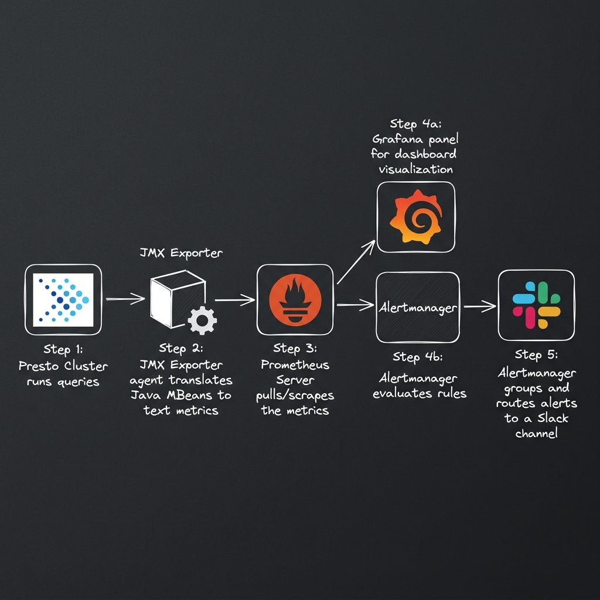
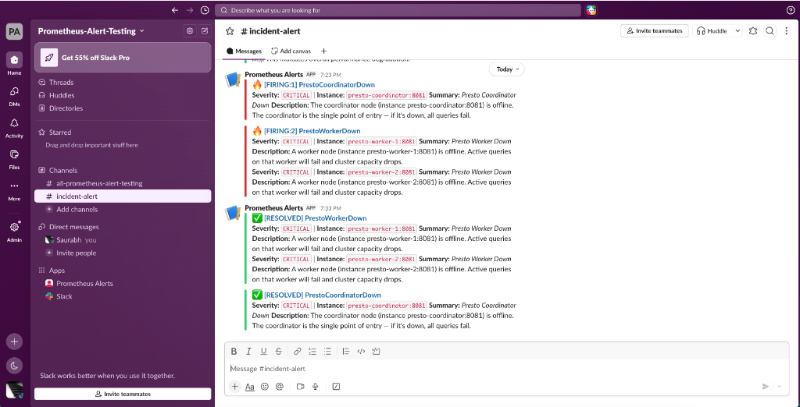
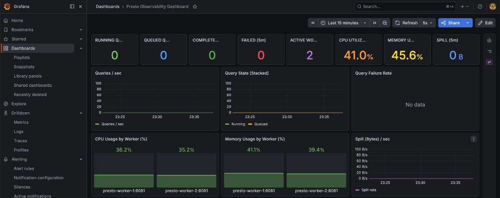
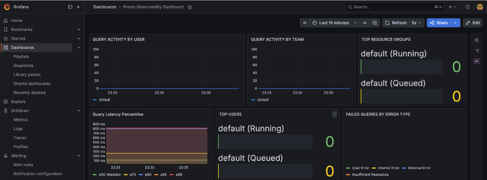
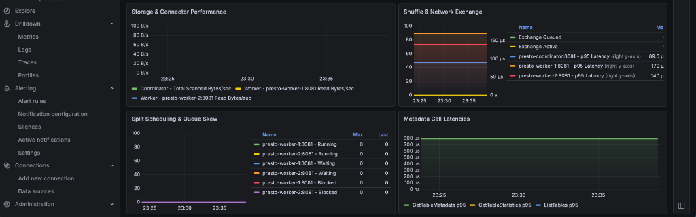

# Presto Observability and Telemetry Pipeline

This repository hosts a fully self-contained, Docker-based monitoring and alerting pipeline for a Presto cluster (consisting of 1 Coordinator and 2 Worker nodes). 

This sandbox environment demonstrates how production-grade observability is configured and integrated. It outlines the configuration and operation of a modern observability stack designed for high throughput distributed database environments.

---

## Observability Architecture and Concepts

To understand how telemetry is collected and managed in this setup, it is important to be familiar with the following components and their roles:

### Prometheus
Prometheus is an open-source systems monitoring and alerting toolkit. It collects and stores metrics as time-series data, meaning metrics information is stored with the timestamp at which it was recorded, alongside optional key-value pairs called labels.
Key features of Prometheus in this pipeline include:
* **Pull-Based Metrics Scraping**: Instead of the Presto servers pushing metrics over the network, Prometheus periodically queries (scrapes) an HTTP metrics endpoint on each target. In this setup, it pulls metrics from port `8081` on the coordinator and workers every 10 seconds.
* **PromQL (Prometheus Query Language)**: A multi-dimensional query language that allows querying metrics in real-time. Grafana uses PromQL queries to display resource usage, latencies, and queues on the dashboards.
* **Rule Evaluation and Alerting**: Prometheus regularly evaluates alerting rules (queries) defined in `alert.rules.yml`. If a query condition is met (e.g., a node goes offline or JVM heap memory exceeds limits), Prometheus triggers an alert.

### Alertmanager
Alertmanager handles alerts sent by client applications such as Prometheus. It takes care of deduplicating, grouping, and routing them to the correct receiver integration (such as Slack, PagerDuty, or email).
Key features of Alertmanager in this pipeline include:
* **Deduplication and Grouping**: Grouping clusters similar alerts into a single notification. For example, if multiple workers go down simultaneously, Alertmanager groups them into a single Slack notification to prevent alert noise.
* **Alert Routing**: Using a routing tree defined in `alertmanager.yml`, Alertmanager formats raw JSON alert payloads into clean, color-coded, human-readable Slack messages and posts them to a designated webhook.

### JMX Exporter (Javaagent)
Presto is a Java application that exposes its internal runtime statistics (e.g., query queue sizes, JVM memory usage, task execution times) via JMX (Java Management Extensions) MBeans. Since Prometheus cannot read JMX directly, we run the JMX Exporter as a Java agent inside the Presto JVM. The agent:
* Whitelists specific Presto and JVM MBeans.
* Translates MBean attributes into Prometheus-compatible counters, gauges, and histograms.
* Exposes them on HTTP port `8081` as raw text for Prometheus to scrape.

### Grafana
Grafana is the visualization layer. It connects to Prometheus as a data source, runs PromQL queries on a schedule, and visualizes the results on a rich dashboard, providing real-time visibility into query workloads, GC overhead, memory usage, and task scheduling.

---

## Step-by-Step Data Flow

Here is how data flows through this pipeline, from a query running in Presto to a Slack notification:



---

## Quick Start

### 1. Prerequisites
Ensure you have **Docker** and **Docker Compose** installed on your machine.

### 2. Launch the Pipeline
From the root of this repository, start all 6 Docker containers in the background:
```bash
docker-compose up -d
```

To verify that all containers are running and healthy, run:
```bash
docker ps
```
You should see `presto-coordinator`, `presto-worker-1`, `presto-worker-2`, `prometheus-server`, `grafana-dashboard`, and `alertmanager-server` up and running.

### 3. Access the Interfaces

| Service | Port | Endpoint URL | Description |
| :--- | :---: | :--- | :--- |
| **Grafana Dashboard** | `3000` | [http://localhost:3000](http://localhost:3000) | **Visualization**: Log in with Username: `admin` / Password: `admin` to view the Presto Cluster Dashboard. |
| **Prometheus UI** | `9090` | [http://localhost:9090](http://localhost:9090) | **Metrics Database**: Check scrape target health (`Status -> Targets`) and write custom PromQL queries. |
| **Alertmanager UI** | `9093` | [http://localhost:9093](http://localhost:9093) | **Alert Routing**: View currently active alerts and silence alert fatigue during maintenance windows. |
| **Presto Coordinator** | `8080` | [http://localhost:8080](http://localhost:8080) | **Presto Web UI**: View active queries, execution plans, and coordinator status. |

---

## Repository File Structure and Roles

Here is a file-by-file breakdown of the repository, explaining what each file does and why it is necessary:

### 1. Orchestration and Presto Configs
* **`docker-compose.yml`**: Defines the orchestration, virtual bridge network, and disk mounts for all 6 containers.
* **`config/presto-shared/presto-jmx-exporter.yaml`**: The whitelist and translation patterns for mapping Presto's internal JMX JVM stats into Prometheus-format gauge/counter metrics.
* **`config/presto-coordinator/etc/jvm.config`**: Sets G1GC, heap limits (`-Xmx1G`), and hooks the JMX Javaagent (`-javaagent:...`) into the coordinator's Java process.
* **`config/presto-coordinator/etc/config.properties`**: Configures discovery server settings, sets coordinator HTTP port (`8080`), and sets limits like task concurrency/query memory.
* **`config/presto-coordinator/etc/catalog/prometheus.properties`**: Installs the Prometheus connector inside Presto, enabling you to query Prometheus metrics directly via SQL queries (e.g. `SELECT * FROM prometheus.default.up`).
* **`config/presto-coordinator/etc/resource-groups.properties`**: Instructs the coordinator to use file-based resource groups for query queueing.
* **`config/presto-coordinator/etc/resource-groups.json`**: Defines the team hierarchy (analysts, data engineering, science) and sets hard concurrency/queue boundaries to simulate corporate resource contention.
* **`config/presto-worker-1/etc/` & `config/presto-worker-2/etc/`**:
  * `jvm.config`: Worker-specific memory and JMX exporter hooks.
  * `config.properties`: Configures local execution memory limits, points to the coordinator's discovery service, and maps local query spilling mount points.
  * `catalog/prometheus.properties`: Enables worker nodes to participate in executing distributed SQL queries targeting Prometheus metrics. (Note: This is strictly for querying Prometheus data via SQL, not for collecting or pushing metrics).

### 2. Telemetry and Scraping (Prometheus)
* **`config/prometheus/prometheus.yml`**: The main configuration file for Prometheus. It outlines global poll intervals, points to the alerting rules configuration file, and maps the scrape addresses for JMX exporters with `coordinator` or `worker` role labels.
* **`config/prometheus/alert.rules.yml`**: Contains all 10 alerting rules (JVM memory metrics, node status, queuing rejections, internal failures, GC overheads) defined in PromQL.

### 3. Routing and Alerts (Alertmanager)
* **`config/alertmanager/alertmanager.yml`**: Directs Prometheus alerts to target endpoints, configures deduplication and grouping times, and defines the Slack payload styling format.

### 4. Visualization (Grafana)
* **`config/grafana/provisioning/datasources/prometheus.yaml`**: Provisions the Prometheus connection (pointing to the Prometheus server container on port 9090) as the default data source in Grafana.
* **`config/grafana/provisioning/dashboards/presto.yaml`**: Configures the Presto dashboard provider in Grafana to automatically scan and import dashboard JSON files from the `/etc/grafana/dashboards` path on startup.
* **`config/grafana/dashboards/presto-dashboard.json`**: The complete definition (grids, queries, labels, variables) for the 24-panel dashboard.

### 5. Binary and Disk Spilling Folders
* **`bin/jmx_prometheus_javaagent.jar`**: The JMX Prometheus Java agent binary. This JAR is injected into the JVM of the Presto coordinator and worker nodes at startup via the `-javaagent` flag. It reads JMX MBeans and exposes them as a Prometheus text metrics endpoint on HTTP port `8081`.
* **`spill/`**: Host-mounted storage directories (`spill/worker-1` and `spill/worker-2`) mapped as Docker volumes to `/tmp/presto/spill` inside the worker containers. When query processing hits node memory limits during joins or aggregations, Presto spills intermediate data here to prevent JVM OutOfMemoryErrors, allowing you to test and visualize disk spilling telemetry.

---

## Configuration File Deep-Dive

### A. JMX Rule Translation
* **File**: `config/presto-shared/presto-jmx-exporter.yaml`
* **Why it matters**: Java MBeans have complex paths (e.g. `com.facebook.presto.execution:name=QueryManagerState`). This file uses regular expression patterns to translate them into flat Prometheus metrics.
* **Example Rule**:
  ```yaml
  - pattern: '(?i).*name=querymanager.*(runningqueries|queuedqueries)'
    name: presto_querymanager_$1
  ```
  This matches any JMX MBean with `querymanager` in its path and translates it to `presto_querymanager_runningqueries` or `presto_querymanager_queuedqueries` inside Prometheus.

### B. Prometheus Scraping Configuration
* **File**: [prometheus.yml](config/prometheus/prometheus.yml)
* **Scrape Configuration**:
  ```yaml
  scrape_configs:
    - job_name: 'presto'
      scrape_interval: 10s   # How often to poll metrics
      scrape_timeout: 9s     # Disconnect if target takes longer than 9s to reply
      static_configs:
        - targets: ['presto-coordinator:8081']
          labels: { role: 'coordinator' }
        - targets: ['presto-worker-1:8081', 'presto-worker-2:8081']
          labels: { role: 'worker' }
  ```
  * `role`: We attach labels to the targets so we can write role-specific alerting rules (e.g., alerting differently if a coordinator goes offline vs. a worker).

### C. Alerting Rules
* **File**: [alert.rules.yml](config/prometheus/alert.rules.yml)
* **Threshold Structure**:
  ```yaml
  - alert: PrestoWorkerDown
    expr: up{role="worker"} == 0
    for: 1m
    labels: { severity: critical }
    annotations:
      summary: "Presto Worker Down"
      description: "A worker node (instance {{ $labels.instance }}) is offline. Active queries on that worker will fail and cluster capacity drops."
  ```
  * `expr`: The PromQL expression. `up` is a built-in metric. `1` means healthy, `0` means down.
  * `for`: The alert must evaluate to `true` continuously for this duration before firing. This prevents brief, temporary network blips from triggering notifications.

### D. Slack Alert Integration via Alertmanager
* **File**: `config/alertmanager/alertmanager.yml`
* **Why it matters**: This file configures how Alertmanager processes incoming alerts from Prometheus, formats them, and routes them to Slack.
* **How to Enable & Configure Slack Alerts**:
  1. **Slack Webhook URL (`api_url`)**: Alertmanager routes alerts to Slack using an **Incoming Webhook URL** generated in your Slack workspace. This URL is set in the `api_url` parameter. If you need to redirect alerts to a new Slack workspace, replace this URL with your new workspace webhook.
  2. **Target Channel (`channel`)**: The `channel` property defines which channel in your Slack workspace receives the alerts (configured to `#incident-alert` by default).
  3. **Color-Coded Severities**: The payload contains a dynamic color template. Alerts are color-coded in the Slack UI based on their status and severity:
     * **Red (`#d63031`)**: Firing critical alerts (e.g., node offline, heap critical).
     * **Orange (`#e17055`)**: Firing high severity alerts.
     * **Yellow (`#fdcb6e`)**: Firing warning severity alerts.
     * **Green (`#2ecc71`)**: Resolved alerts (sent automatically when the metric goes back to normal).
  4. **Active Resolves**: `send_resolved: true` is configured so that when a failing condition resolves, Alertmanager automatically sends a follow-up green-colored notification to the same channel to let engineers know the issue has cleared.

### E. Alert Format Example
Below is a snapshot of how Alertmanager formats and routes firing and resolved alerts to the `#incident-alert` Slack channel:



---

## Developer Guide: Discovering and Customizing Metrics

If you want to extend this monitoring setup or customize the dashboards and alerts, this guide explains how to find the right metrics for your use case and integrate them into the pipeline.

### 1. How to Discover New Metrics
Presto exposes thousands of internal telemetry variables via JMX (Java Management Extensions) MBeans. You can discover what metrics are available using the following methods:

#### A. Exploring via SQL (JMX Connector)
The built-in JMX connector allows you to query active MBeans directly using SQL:
* **List all JMX tables (MBeans):**
  ```sql
  SHOW TABLES FROM jmx.current;
  ```
  *(Note: Presto automatically maps all mixed-case JMX MBean names to lowercase table names, e.g. `com.facebook.presto.execution:name=querymanager`)*
* **Inspect the attributes (columns) of an MBean:**
  ```sql
  DESCRIBE jmx.current."com.facebook.presto.execution:name=querymanager";
  ```
* **Query active metrics across all nodes (using the implicit `node` column):**
  ```sql
  SELECT node, vmname, vmversion FROM jmx.current."java.lang:type=runtime";
  ```

#### B. Visual Browsing (VisualVM / JConsole)
For a visual tree directory structure of all MBeans:
1. Connect a tool like **VisualVM** or **JConsole** to your Presto JVM. Note that JMX Remote access is not enabled by default in this sandbox; to use it, you must configure JMX remote properties (e.g. `-Dcom.sun.management.jmxremote.port=9080`) in `jvm.config` and expose that port in `docker-compose.yml`.
2. Navigate to the **MBeans** tab.
3. Browse the hierarchy (e.g. `com.facebook.presto` -> `execution` -> `QueryManager`) to see all attributes and live values.

---

### 2. Targeting Key Metrics by Use Case
When designing new dashboards or alerts, target metrics according to these operational requirements:

| Operational Use Case | JMX MBean (Table) Name | Key Attributes (Columns) | What It Measures |
| :--- | :--- | :--- | :--- |
| **Query Performance** | `com.facebook.presto.execution:name=querymanager` | `RunningQueries`, `QueuedQueries`, `FailedQueries.TotalCount`, `ExecutionTime` | Check queue bottlenecks, sudden failure rates, and execution time distribution. |
| **JVM Memory & GC** | `java.lang:type=Memory`<br>`java.lang:type=GarbageCollector` | `HeapMemoryUsage`, `CollectionTime` | Monitors JVM heap consumption and length of "Stop-the-World" GC pauses. |
| **Task Execution** | `com.facebook.presto.execution.executor:name=taskexecutor` | `RunningSplits`, `WaitingSplits`, `BlockedSplits` | Checks worker thread saturation, I/O bottlenecks, and execution delays. |
| **Cluster Memory** | `com.facebook.presto.memory:name=clustermemorymanager` | `ClusterMemoryBytes` | Measures total available cluster-wide query execution memory. |
| **Metadata Latencies** | `com.facebook.presto.metadata:name=metadatamanagerstats` | `GetTableMetadataTime`, `GetTableStatisticsTime` | Monitors catalog metastore latency (e.g., slow Hive or Glue metadata calls). |

---

### 3. Integrating New Metrics into the Pipeline
Once you have identified the JMX metrics you need, follow these steps to add them to your dashboards:

1. **Whitelist the MBeans:** In `config/presto-shared/presto-jmx-exporter.yaml`, add the MBean name pattern to the `includeObjectNames` section.
2. **Define Translation Rules:** In the `rules` section of the same file, write a regular expression pattern to match the MBean attributes and name the resulting Prometheus metric (e.g. mapping `QueryManager.RunningQueries` to `presto_querymanager_runningqueries`).
3. **Scrape and Verify:** Restart the pipeline containers to apply the configuration. Verify that Prometheus is scraping the new metrics by querying them in the Prometheus UI (`http://localhost:9090`).
4. **Create Dashboard Panels:** Use the Prometheus data source in Grafana to build new visualization panels using PromQL queries.

---

## Grafana Dashboard Panel Directory

The pre-configured Grafana dashboard consists of **24 distinct panels** grouped into three logical rows. Below is a directory explaining what each panel shows, where its telemetry originates in Presto, and why it is critical for operations.

### Row 1: Cluster Performance and Volume KPIs (Panels 1–14)

This row displays real-time health statistics, overall cluster performance, worker node activity, and disk spilling metrics.

| Panel Name | What It Shows | Presto JMX Source MBean & Attribute | Prometheus Metric Name | Operational Significance |
| :--- | :--- | :--- | :--- | :--- |
| **1. RUNNING QUERIES** | Number of queries currently executing. | `QueryManager` -> `RunningQueries` | `presto_querymanager_runningqueries` | Indicates active workload. High values suggest system saturation. |
| **2. QUEUED QUERIES** | Number of queries waiting in resource groups. | `QueryManager` -> `QueuedQueries` | `presto_querymanager_queuedqueries` | Indicates queue congestion due to concurrency limits. |
| **3. COMPLETED (5m)** | Count of queries completed in the last 5 minutes. | `QueryManager` -> `CompletedQueries` | `presto_querymanager_completedqueries_total` | Measures overall query throughput. |
| **4. FAILED (5m)** | Count of queries that failed in the last 5 minutes. | `QueryManager` -> `FailedQueries` | `presto_querymanager_failedqueries_total` | Alerts you to active errors or failing user workloads. |
| **5. ACTIVE WORKERS** | Count of worker nodes currently online. | `ClusterMemoryManager` -> `ActiveNodes` | `count(up{role="worker"} == 1)` | Ensures all workers are healthy and participating. |
| **6. CPU UTILIZATION** | Overall cluster-wide CPU percentage. | JVM `OperatingSystemMXBean` | `process_cpu_seconds_total` | High values indicate heavy execution, GC, or serialization. |
| **7. MEMORY UTILIZATION** | Heap memory usage as a percentage of max heap. | JVM `MemoryMXBean` | `jvm_memory_bytes_used / jvm_memory_bytes_max` | High memory usage warns of JVM stability and OutOfMemory risks. |
| **8. SPILL (5m)** | Total data spilled to disk in the last 5 minutes. | `SpillerStats` -> `TotalSpilledBytes` | `presto_spill_spilledbytes_total` | Indicates queries exceeding node memory limits, slowing execution. |
| **9. Queries / sec** | The rate of query submissions per second. | `QueryManager` -> `SubmittedQueries` | `rate(presto_querymanager_submittedqueries_total[1m])` | Measures user transaction request rate over time. |
| **10. Query State (Stacked)** | Real-time stacked chart of running vs. queued queries. | `QueryManager` -> `RunningQueries` & `QueuedQueries` | `presto_querymanager_runningqueries` / `_queuedqueries` | Visualizes the transition of queries from queue to execution. |
| **11. Query Failure Rate** | Percentage of completed queries that are failing. | `QueryManager` -> `FailedQueries` & `CompletedQueries` | `presto_querymanager_failedqueries_total` / `presto_querymanager_completedqueries_total` (expressed as a percentage) | Helps differentiate normal traffic from query failures. |
| **12. CPU Usage by Worker (%)** | Breakdown of CPU usage for each individual worker node. | JVM `OperatingSystemMXBean` per node | `process_cpu_seconds_total{role="worker"}` | Detects CPU skew or imbalances across workers. |
| **13. Memory Usage by Worker (%)** | Heap memory breakdown for each worker node. | JVM `MemoryMXBean` per node | `jvm_memory_bytes_used{role="worker"}` | Pinpoints worker memory leaks or unequal task memory load. |
| **14. Spill (Bytes) / sec** | Disk write rate of spilled intermediate data. | `SpillerStats` -> `TotalSpilledBytes` | `rate(presto_spill_spilledbytes_total[1m])` | Identifies active spilling queries that are thrashing disk IO. |

---

### Row 2: Query Activity and Latency Percentiles (Panels 15–20)

This row breaks down queries by user, team resource groups, latencies, and failure types to isolate tenant-specific issues.

| Panel Name | What It Shows | Presto JMX Source MBean & Attribute | Prometheus Metric Name | Operational Significance |
| :--- | :--- | :--- | :--- | :--- |
| **15. QUERY ACTIVITY BY USER** | Active/queued queries per individual database user. | `resourceGroups` -> `RunningQueries` / `QueuedQueries` | `presto_user_resourcegroup_runningqueries` (summed by `user` label) | Identifies single users submitting high query volumes. |
| **16. QUERY ACTIVITY BY TEAM** | Active/queued queries per team (e.g. data engineering). | `resourceGroups` -> `RunningQueries` / `QueuedQueries` | `presto_user_resourcegroup_runningqueries` (summed by `team` label) | Monitors resource allocation and quota usage across teams. |
| **17. TOP RESOURCE GROUPS** | Bar gauge of busiest resource groups. | `resourceGroups` -> `RunningQueries` / `QueuedQueries` | `presto_user_resourcegroup_runningqueries` & `_queuedqueries` (summed by `team` label) | Highlights which resource groups are closest to capacity. |
| **18. Query Latency Percentiles** | P50, P75, P90, P95, and P99 query runtimes. | `QueryManager` -> `ExecutionTime` distribution | `presto_querymanager_executiontime_alltime_p95` (etc.) | Tracks user SLA metrics. Spikes indicate degradation. |
| **19. TOP USERS** | Heatmap/ranking of users running the most queries. | `resourceGroups` -> `RunningQueries` grouped by `user` | `sum by (user) (presto_user_resourcegroup_runningqueries)` | Identifies power users or runaway automated service accounts. |
| **20. FAILED QUERIES BY ERROR TYPE** | Queries categorized by failure type (User, Internal, External, Insufficient Resources). | `QueryManager` -> Failure counters (`UserError`, `Internal`, `External`, `InsufficientResources`) | `presto_querymanager_usererrorfailures_total` (etc.) | Classifies failures (e.g. syntax errors vs. cluster memory rejections). |

---

### Row 3: Storage, Network Exchange and Metadata Latencies (Panels 21–24)

This row monitors external storage subsystems, connector calls, network data shuffles, and metadata catalog latency.

| Panel Name | What It Shows | Presto JMX Source MBean & Attribute | Prometheus Metric Name | Operational Significance |
| :--- | :--- | :--- | :--- | :--- |
| **21. Storage & Connector Performance** | Volume of raw bytes scanned from storage per second. | `QueryManager` -> `ConsumedInputBytes` & `TaskManager` -> `InputDataSize` | `rate(presto_querymanager_consumedinputbytes_total[1m])` | Monitors raw read throughput from storage (S3, Hive, databases). |
| **22. Shuffle & Network Exchange** | Active HTTP client communication and shuffle threads. | `ExchangeExecutionMBean` & `airlift.http.client` | `presto_exchange_executor_activecount`, `presto_airlift_http_client_responsetime_fiveminutes_p95` | Monitors internal data transfer performance between workers. |
| **23. Split Scheduling & Queue Skew** | Task execution splits categorized by state. | `TaskExecutor` -> `RunningSplits`, `WaitingSplits`, `BlockedSplits` | `presto_executor_taskexecutor_splits` with `state` label | High `BlockedSplits` indicates storage bottlenecks; high `Waiting` indicates CPU thread starvation. |
| **24. Metadata Call Latencies** | Latencies for catalog metadata API calls (e.g. Hive metastore). | `MetadataManagerStats` & Hive metastore stats MBeans | `presto_metadata_manager_time` & `presto_metastore_api_time` | High latencies isolate catalog registry (Hive, Glue) overheads. |

---

## Presto Observability Dashboard Snapshots

Below are snapshots of the 24-panel Presto Observability Dashboard provisioned in this setup:

### 1. Cluster Performance & Volume KPIs


### 2. Query Activity & Latency Percentiles


### 3. Storage, Network Exchange & Metadata Latencies


---

## Additional Resources

* **Presto Official Website**: [prestodb.io](https://prestodb.io)
* **Presto JMX Connector Documentation**: [Presto JMX Connector Docs](https://prestodb.io/docs/current/connector/jmx.html)
* **Presto Slack Community**: [Join the Presto Slack Community](https://communityinviter.com/apps/prestodb/prestodb)
